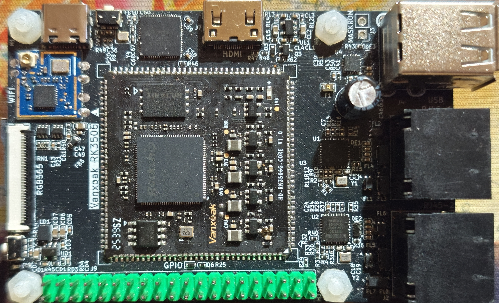

# Vanxoak_RK3506_DevBrd

Vanxoak_RK3506_DevBrd是一个专门为万科奥华的RK3506的邮票孔核心板设计的扩展板。PCB的结构参考了树莓派，不过为例方便Layout扩展排针略有不同。PCB为两层板双面贴设计，满足嘉立创的免费工艺，极大地降低了复刻成本。

<!-- PROJECT SHIELDS -->

[![Contributors][contributors-shield]][contributors-url]
[![Forks][forks-shield]][forks-url]
[![Stargazers][stars-shield]][stars-url]
[![Issues][issues-shield]][issues-url]
[![Apache License][license-shield]][license-url]
[![LinkedIn][linkedin-shield]][linkedin-url]

<!-- Hardware Picture or Logo -->
 

  

  <h3 align="center">Vanxoak_RK3506_DevBrd</h3>
  

     
    <a href="https://github.com/TriEverthing/Vanxoak_RK3506_DevBrd"><strong>探索本项目的文档 »</strong></a>
     
     
    <a href="https://github.com/TriEverthing/Vanxoak_RK3506_DevBrd">查看Demo</a>
    ·
    <a href="https://github.com/TriEverthing/Vanxoak_RK3506_DevBrd/issues">报告Bug</a>
    ·
    <a href="https://github.com/TriEverthing/Vanxoak_RK3506_DevBrd/issues">提出新特性</a>
  

 
## 目录
- [文件目录说明](#文件目录说明)
- [版本控制](#版本控制)
- [作者](#作者)

### 文件目录说明

### 版本控制

该项目使用Git进行版本管理。您可以在repository参看当前可用版本。

### 作者

TriEverthing

### 版权说明

该项目签署了Apache 授权许可，详情请参阅 [LICENSE.txt](https://github.com/TriEverthing/Vanxoak_RK3506_DevBrd/master/LICENSE.txt)

<!-- links -->
[your-project-path]:TriEverthing/Vanxoak_RK3506_DevBrd

[contributors-shield]: https://img.shields.io/github/contributors/TriEverthing/Vanxoak_RK3506_DevBrd.svg?style=flat-square
[contributors-url]: https://github.com/TriEverthing/Vanxoak_RK3506_DevBrd/graphs/contributors

[forks-shield]: https://img.shields.io/github/forks/TriEverthing/Vanxoak_RK3506_DevBrd.svg?style=flat-square
[forks-url]: https://github.com/TriEverthing/Vanxoak_RK3506_DevBrd/network/members

[stars-shield]: https://img.shields.io/github/stars/TriEverthing/Vanxoak_RK3506_DevBrd.svg?style=flat-square
[stars-url]: https://github.com/TriEverthing/Vanxoak_RK3506_DevBrd/stargazers

[issues-shield]: https://img.shields.io/github/issues/TriEverthing/Vanxoak_RK3506_DevBrd.svg?style=flat-square
[issues-url]: https://img.shields.io/github/issues/TriEverthing/Vanxoak_RK3506_DevBrd.svg

[license-shield]: https://img.shields.io/github/license/TriEverthing/Vanxoak_RK3506_DevBrd.svg?style=flat-square
[license-url]: https://github.com/TriEverthing/Vanxoak_RK3506_DevBrd/blob/master/LICENSE.txt

[linkedin-shield]: https://img.shields.io/badge/-LinkedIn-black.svg?style=flat-square&logo=linkedin&colorB=555
[linkedin-url]: https://linkedin.com/in/TriEverthing